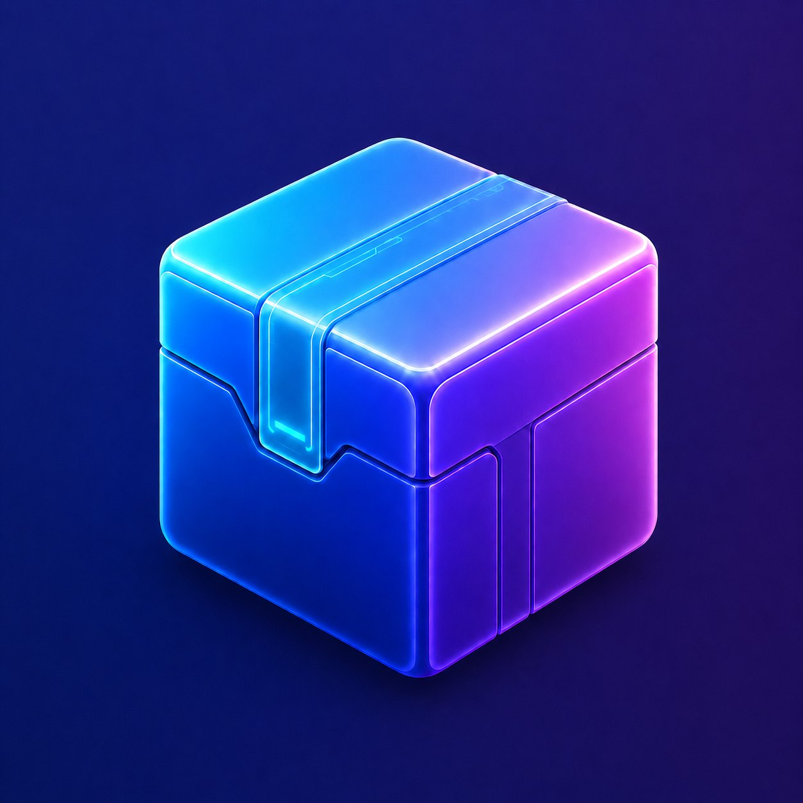

# Status Box 📦




**Status Box** is a lightweight, native macOS menu bar utility that keeps your crowded status bar under control. Place the tape marker after the icons you want to hide, then use the box icon or shortcuts to hide, reveal, or open those menu bar apps from a compact floating Box UI.

## ✨ Features

* **Menu Bar Icon Hiding:** Hide status bar icons to the left of the tape marker without quitting the underlying apps.
* **Tape Marker Workflow:** Use the tape icon as the boundary that decides which menu bar icons belong in Status Box.
* **Compact Box UI:** Open a floating macOS glass-style Box UI that shows hidden menu bar apps as icons.
* **App Window Activation:** Left-click an app icon in Box UI to bring that app's window forward when supported.
* **Native Menu Access:** Right-click an app icon in Box UI to open its native `NSMenu` when the app exposes one.
* **Unsupported App Feedback:** Apps that cannot open a window or expose a usable native menu are shown as unsupported.
* **Auto-Hide:** Automatically hide menu bar icons again after a configurable delay.
* **Configurable Icon Grid:** Choose how many Box UI icons appear per row.
* **Optional Box UI Alerts:** Turn Box UI alert text on or off. When alerts are off, the Box UI trims its lower spacing.
* **Configurable Shortcuts:** Change or disable global shortcuts from Settings.
* **Launch at Login:** Start Status Box automatically when you sign in.
* **Lightweight & Native:** Built with Swift and AppKit. No Electron.

## ⌨️ Shortcuts

| Shortcut | Action |
| --- | --- |
| `Option + B` | Toggle hidden menu bar icons |
| `Command + B` | Toggle Box UI |

*You can change shortcuts from Settings > General > Shortcuts.*
*You can disable all shortcuts with Settings > General > Shortcuts > Enable shortcuts.*
*If a shortcut conflicts with another app, choose a less common combination or disable Status Box shortcuts.*

## 🚀 Installation & Build

Status Box is built with Swift Package Manager and a small app-bundle build script.

### Install via Homebrew

Once a release is published and the cask is added to `elixirevo/tap`, install with:

```bash
brew tap elixirevo/tap
brew install --cask status-box
```

If you already tapped `elixirevo/tap`, this also works:

```bash
brew install --cask status-box
```

### Prerequisites

* macOS 13.0 or later
* Xcode Command Line Tools (`xcode-select --install`)

### Build Steps

1. Clone the repository:

   ```bash
   git clone https://github.com/elixirevo/statusbox.git
   cd status-box
   ```

2. Build the Swift executable:

   ```bash
   swift build
   ```

3. Build the macOS app bundle:

   ```bash
   ./scripts/build_app.sh
   ```

4. The built application will be located at:

   ```text
   dist/StatusBox.app
   ```

5. Move it to your Applications folder:

   ```bash
   mv dist/StatusBox.app /Applications/
   ```

### Build a Universal DMG

Build a universal app (`arm64 + x86_64`) and package it as a DMG:

```bash
./scripts/build_dmg.sh
```

This creates:

```text
dist/StatusBox-1.0.0-universal.dmg
```

You can override release metadata when needed:

```bash
VERSION=1.0.0 BUILD=1 ./scripts/build_dmg.sh
```

The script also prints the SHA-256 checksum.

### Prepare a Homebrew Release

Before publishing the Homebrew cask:

1. Upload `dist/StatusBox-1.0.0-universal.dmg` to the GitHub release `v1.0.0`.
2. Copy `homebrew/Casks/status-box.rb` into the `elixirevo/homebrew-tap` repository.
3. Replace `REPLACE_WITH_RELEASE_SHA256` with the printed checksum.
4. Update the cask `version` when releasing a new app version.

## 🔒 Permissions

Status Box requires:

1. **Accessibility:** Required to discover menu bar status items and open supported native menus from Box UI.

If Accessibility permission does not apply after rebuilding the app, remove the old Status Box entry from System Settings > Privacy & Security > Accessibility, then add `dist/StatusBox.app` again.

*Note: Status Box works locally on your Mac. It does not send menu bar data or app information over the network.*

## 🧭 Usage

1. Launch Status Box.
2. Move the tape icon with macOS Command-drag so it sits to the right of the menu bar icons you want to hide.
3. Click the box icon or press `Option + B` to hide or show those icons.
4. Right-click the box icon or press `Command + B` to open Box UI.
5. In Box UI:
   * Left-click an app icon to open its app window when supported.
   * Right-click an app icon to open its native menu when supported.
6. Right-click the tape icon to open Settings or quit Status Box.

## ⚠️ Limitations

macOS does not provide a public API for taking ownership of third-party menu bar icons. Status Box uses the same general hiding approach as menu bar spacer utilities: it moves the tape marker to push selected icons out of the visible menu bar area.

Box UI support depends on what each app exposes through Accessibility and native menu APIs. Some apps show a window, some expose an `NSMenu`, and some do neither in a way Status Box can safely control.

## 🛠 Contributing

Contributions are welcome. If you have ideas for new features, bug fixes, or improvements, feel free to open an issue or submit a pull request.

1. Fork the project
2. Create your feature branch (`git checkout -b feature/AmazingFeature`)
3. Commit your changes (`git commit -m 'Add some AmazingFeature'`)
4. Push to the branch (`git push origin feature/AmazingFeature`)
5. Open a pull request

## 📄 License

Distributed under the MIT License. See `LICENSE` for more information.
